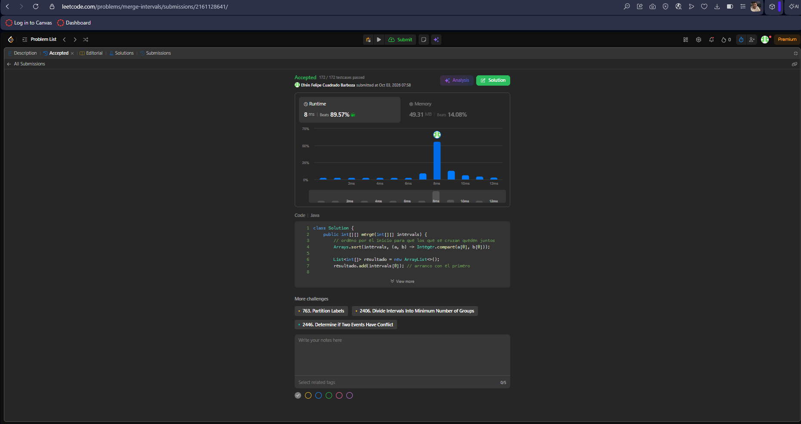
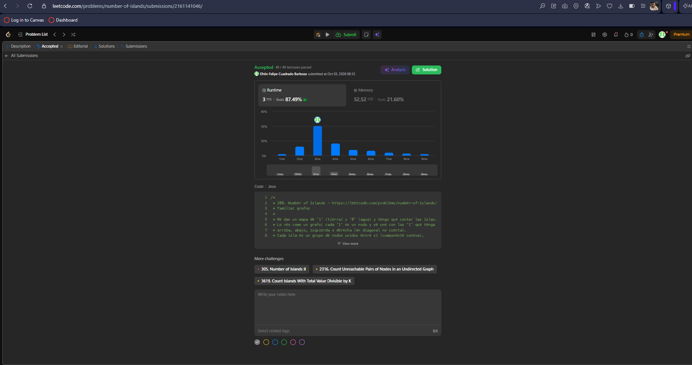
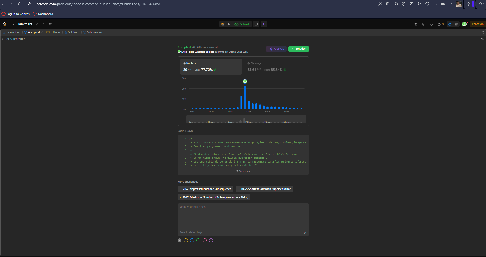
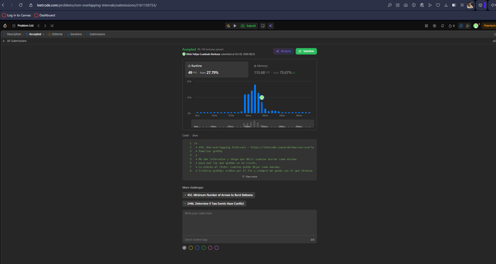
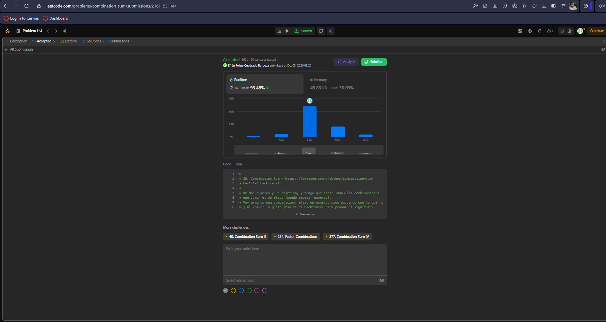

# Taller · Cinco familias en LeetCode

## 56. Merge Intervals

Enlace: https://leetcode.com/problems/merge-intervals/  
Familia: ordenamiento  
Idea: se ordenan los intervalos por su inicio y luego se recorren una sola vez;
si el actual empieza antes o justo cuando termina el último, se fusionan
(el fin queda en el mayor de los dos); si no, se abre un intervalo nuevo.  
Complejidad: tiempo O(n log n) por el ordenamiento (la pasada es O(n));
espacio O(n) para la salida. n = número de intervalos.  
Código: [merge-intervals/Solution.java](merge-intervals/Solution.java)

## 200. Number of Islands

Enlace: https://leetcode.com/problems/number-of-islands/

Familia: grafos

Modelo: cada celda '1' es un vértice; hay arista entre dos celdas '1' vecinas
(arriba, abajo, izquierda, derecha). Grafo no dirigido. Contar islas es contar
componentes conexas (grupos de celdas de tierra unidas entre sí).

Idea: se recorre la grilla; cada '1' sin visitar es una isla nueva y con DFS
se hunde toda la isla (se cambia a '0') para no contarla dos veces.

Complejidad: tiempo Θ(m·n), cada celda se visita una vez; espacio O(m·n) en el
peor caso por la pila de recursión. m = filas, n = columnas.

Código: [number-of-islands/Solution.java](number-of-islands/Solution.java)

## 1143. Longest Common Subsequence

Enlace: https://leetcode.com/problems/longest-common-subsequence/

Familia: programación dinámica

Estado: dp[i][j] = longitud de la LCS de los primeros i caracteres de text1
y los primeros j caracteres de text2.

Base: dp[0][j] = dp[i][0] = 0 (un prefijo vacío no comparte nada).

Recurrencia: si text1[i-1] == text2[j-1], dp[i][j] = dp[i-1][j-1] + 1;
si no, dp[i][j] = max(dp[i-1][j], dp[i][j-1]).

Complejidad: tiempo Θ(n·m) y espacio Θ(n·m) por la tabla.
n = longitud de text1, m = longitud de text2.

Código: [longest-common-subsequence/Solution.java](longest-common-subsequence/Solution.java)

## 435. Non-overlapping Intervals

Enlace: https://leetcode.com/problems/non-overlapping-intervals/

Familia: greedy

Idea: es la selección de actividades al revés. Se ordenan los intervalos por
su fin y se va eligiendo el siguiente que empieza cuando (o después de que)
termina el último aceptado. Criterio greedy: entre los que caben, quedarse con
el que termina antes, porque deja más espacio libre. La respuesta es
n − (cuántos se quedaron).

Complejidad: tiempo O(n log n) por el ordenamiento (la pasada es O(n));
espacio O(1) extra, aparte del que use el sort. n = número de intervalos.

Código: [non-overlapping-intervals/Solution.java](non-overlapping-intervals/Solution.java)

## 39. Combination Sum

Enlace: https://leetcode.com/problems/combination-sum/

Familia: backtracking

Idea: se arma la combinación de forma recursiva. Se elige candidates[i], se
busca con lo que falta (target − suma) volviendo a empezar en i para poder
repetir el número, y al regresar se quita el último elegido (se deshace) para
probar el siguiente. Si lo que falta es 0 se guarda una copia; si un número es
mayor que lo que falta, se poda esa rama. No se vuelve a índices menores, así
no se repiten combinaciones en otro orden.

Complejidad: tiempo exponencial, O(n^(t/min)) en el peor caso, porque la
combinación más larga tiene t/min elementos y en cada nivel se prueban hasta n
candidatos. Espacio O(t/min) por la pila de recursión, más el tamaño de la
salida. n = número de candidatos, t = target, min = candidato más pequeño.

Código: [combination-sum/Solution.java](combination-sum/Solution.java)

